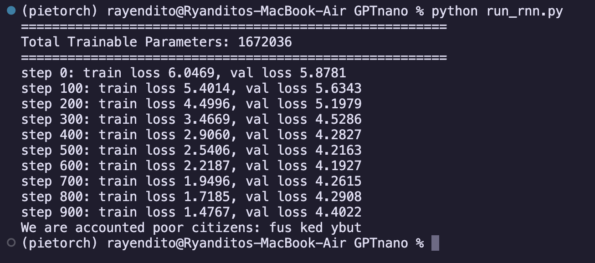

# ScratchLMs (repo soon to be renamed)
some NN architectures that are implemented from scratch[^1] in PyTorch

## Implemented Architectures
1. **GPT** – Decoder only Transformers (based on Andrej Karpathy's [nanoGPT](https://github.com/karpathy/nanoGPT)) ([debugging notebook](https://colab.research.google.com/drive/1y9XAKnat5iWr3H4jsWgqDsW6frrm9_sy?usp=sharing))
2. **RNN** – a simple recurrent network (Elman network, based on [this wikipedia page](https://en.wikipedia.org/wiki/Recurrent_neural_network))
3. **Transformers** - the OG [Attention is All You Need](https://arxiv.org/abs/1706.03762) (**unfinished**, but encoder and decoder blocks should work)
4. Coming soon: [BackpackLM](https://arxiv.org/abs/2305.16765) (needs Transformers to be finished first)
5. Coming soon: maybe? CNN

### Extras
1. BPE encoding, also based on Andrej Karpathy's [implementation](https://github.com/karpathy/minbpe)
> Warning: Using BPE includes training the BPE tokenizer, which takes a long time if running on the `input.txt`, so there's a smaller version, `input_smaller.txt` that's just one paragraph lol.

> UPDATE: do not use for training (manual tokenizing ok tho, haven't integrated to include special tokens, so far only charaver level tokenization)
2. Coming soon: LoRA

## How to run
get an environment with PyTorch. aaand that's it i guess (?). i developed on a M2 machine maybe soon if i'm learning about parallelization i'll start building on the PC. MacOS has an MPS that i can use, but it made the training way slower than if i ran it using CPU. i read somewhere that it's bc MPS isn't fully adapted yet by PyTorch or something(?) so for the time being let's not use MPS lol
```
pip install pytorch
```
and simply do
```
python run_<ARCHITECTURE>.py
```
## Results
### GPT Training Results (Smaller Shakespeare data)
as expected, the results are not too good (only a very small number of parameters lol) but i don't intend this to be a production-ready model. model converges so far, and i think if we add more training steps the val loss can still decrease


### RNN Training Results (Smaller Shakespeare data)
worse than GPT. training time is a lot slower which is unsurprising because it processes sentences sequentially, unlike GPT. architecture is pretty much the same with GPT (same dropouts, add+norm, additional layers, etc), the only thing that's changed is the attention layers, which i replaced with recurrent layers. also no positional encoding since i figured the sequential processing of this model would already indicate position. this one i don't implement according to any specific tutorial, just wikipedia and vibes (lol) feel free to send a PR if there are any suggestions


***

[^1]: well, there are many opinions on what 'from scratch' means and in this one i mean i'm implementing them as long as i'm not using the prebuilt pytorch modules like nn.RNN. one can theoretically go as extreme as making stuff from sand, working their way up to a working NN through making their own silicone, transistors, processors, OS, and all that jazz, kinda like [the toaster project](https://www.thomasthwaites.com/the-toaster-project/). but for the time being, we're gonna start pretty high up in the layers of abstraction :)
